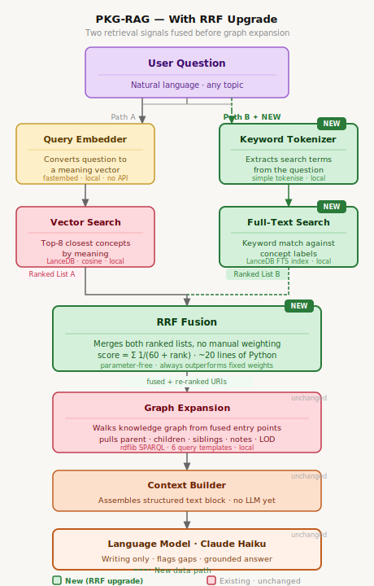

# PKGraphRAG — Personal Knowledge Graph RAG System

A hybrid GraphRAG system built from personal Freeplane mindmaps. Combines deterministic SPARQL querying over an RDF knowledge graph with semantic vector search via LanceDB to enable grounded, natural-language Q&A over a personal knowledge base.

**Status:** Weeks 1–8 of 12 complete · Week 9 in progress

---

## Architecture

### Current (Weeks 1–8)

```
Freeplane .mm files (10 maps)
        │
        ▼
parse_mm_to_rdf.py          ← .mm XML → RDF triples (rdflib)
        │
        ▼
outputs/*.ttl               ← 142,796 triples across 10 maps
        │
   ┌────┴────┐
   ▼         ▼
validate_rdf.py        embed_to_lancedb.py
(SPARQL queries)       (fastembed → LanceDB)
                             │
                             ▼
                       pkg_lancedb/          ← 31,983 vectors, 384-dim
                             │
                             ▼
                       retrieve.py           ← Sequential: vector search → SPARQL graph expansion
                             │
                             ▼
                       ask.py               ← Claude API → grounded Q&A
```

**Key design note:** Retrieval is sequential, not parallel. `retrieve.py` runs vector search first to find the top-K entry-point URIs, then uses SPARQL to expand each URI outward (parent, children, siblings, notes, LOD links). There is only one ranked signal (vector similarity), so no fusion occurs. The LLM is invoked only after context is fully assembled — zero LLM calls in the retrieval path.

### Week 9 Upgrade — RRF (Reciprocal Rank Fusion)



Adding a second independent retrieval signal (full-text keyword search on concept labels) enables true ranked-list fusion via RRF before graph expansion. The formula `score = Σ 1/(60 + rank)` merges both lists with no manual weight tuning.

**Changes:**
- Add LanceDB FTS index on concept labels (~1 line of config)
- Add `KeywordRetriever` alongside `SemanticRetriever` in `retrieve.py`
- Add ~20-line `rrf_fuse()` function to merge ranked lists
- Graph expansion and everything downstream: **unchanged**

---

## Knowledge Base

| Map | Domain | Concepts |
|---|---|---|
| `dlvr.mm` | Business / Ventures | 5,763 |
| `ajared.mm` | Ajared Research | 4,538 |
| `careerDevelopment.mm` | Career & Job Search | 4,131 |
| `new product Development Professional.mm` | Product Management | 4,199 |
| `data.mm` | Data Engineering | 2,187 |
| `life.mm` | Personal / Life | 2,826 |
| `Books.mm` | Library & Learning | 2,198 |
| `linkeddataSemanticWeb.mm` | AI + Linked Data | 1,912 |
| `blog.mm` | Blog Content | 729 |
| `geospatial.mm` | Geospatial | 172 |

**Total: 31,983 embedded concepts · 142,796 RDF triples**

> `pitchstone.mm` and `neogov.mm` are permanently excluded (employer-proprietary data).

---

## Scripts

| Script | Purpose |
|---|---|
| `parse_mm_to_rdf.py` | Parses all `.mm` files → `.ttl` RDF (rdflib). Handles node hierarchy, URLs, notes, tasks, timestamps, LOD exclusions. |
| `validate_rdf.py` | Runs 12 SPARQL queries to validate graph coverage, structure, and quality. |
| `lod_enrich.py` | Enriches root + depth-1/2 concept nodes with DBpedia / Wikidata `owl:sameAs` links. |
| `embed_to_lancedb.py` | Extracts concept labels from TTLs, prepends parent context, embeds via `BAAI/bge-small-en-v1.5`, stores in LanceDB. |
| `retrieve.py` | Sequential hybrid retrieval: LanceDB vector search finds top-K URIs → SPARQL graph expansion enriches each. Usable as CLI or importable module. |
| `ask.py` | End-to-end Q&A: calls `HybridRetriever`, assembles context, calls Claude API, returns structured result. No LLM in retrieval path. |
| `test_qa.py` | Runs 20 test questions across all 10 maps, outputs JSON + markdown report. |
| `visualise_ontology.py` | Renders the PKG ontology as a graph diagram. |
| `setup_store.py` | Initialises the RDF triple store. |

---

## Ontology

Namespace: `https://pkg.chunnodu.com/ontology#`

Built on standard vocabularies — `skos:` for concept hierarchy, `schema:` for typed resources, `dc:` for metadata — with a minimal custom `pkg:` namespace for project-specific types and properties.

Key custom types: `pkg:Task`, `pkg:PersonalNote`, `pkg:Resource`, `pkg:LogEntry`, `pkg:Goal`, `pkg:Project`

Key custom properties: `pkg:hasSubTopic`, `pkg:sourceMap`, `pkg:status`, `pkg:dateLogged`

See `pkg_ontology.ttl` for the full schema.

---

## Outputs

| Path | Contents |
|---|---|
| `outputs/*.ttl` | 10 RDF graphs (one per map) + `lod_enrichment.ttl` |
| `pkg_lancedb/` | LanceDB vector store — 31,983 concepts, 384-dim, 85 MB |
| `pkg_ontology.ttl` | Full PKG ontology in Turtle |
| `LOD_Concept_Inventory.xlsx` | 292-row inventory of LOD-enriched concepts |

---

## Roadmap

| Week | Focus | Status |
|---|---|---|
| 1–6 | Foundations, parsing, enrichment, SPARQL, embeddings | ✅ Done |
| 7 | Hybrid retrieval: vector search → SPARQL graph expansion | ✅ Done |
| 8 | Claude API integration: 20/20 Q&A tests passing (100%) | ✅ Done |
| 9 | RRF upgrade + prompt refinement + ontology gap-filling | 🔄 In progress |
| 10 | CLI query interface (`ask.py` already complete) | ✅ Done early |
| 11–12 | Final polish, architecture diagrams, v2 roadmap | ⬜ |

---

## Tech Stack

- **Python 3.10+** · rdflib · fastembed · lancedb · pyarrow
- **Embeddings:** `BAAI/bge-small-en-v1.5` (384-dim, ONNX via fastembed)
- **Vector DB:** LanceDB (embedded, no server)
- **RDF:** Turtle serialisation, SPARQL via rdflib
- **Source format:** Freeplane `.mm` (XML)
